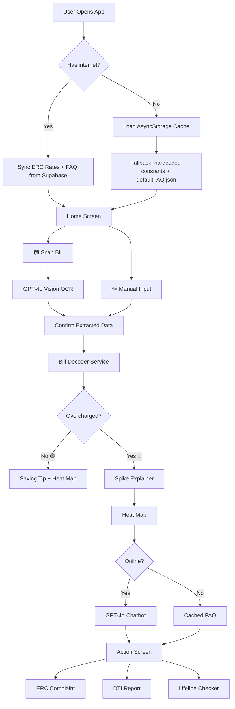

# Architecture

## Overview

KuryenteKo is a mobile-first React Native application built with Expo SDK 51. It follows a feature-first directory structure with a clear separation between UI screens, business logic services, and data access. The core data flow is: user (camera or manual input) → bill service (analysis logic) → Supabase (community data) / OpenAI API (OCR + AI chat) → verdict screen → action screens. All core features degrade gracefully to an offline mode using AsyncStorage-cached rate tables and FAQ data.

---

## System Layers

```
┌──────────────────────────────────────────────┐
│              Mobile App (Expo RN)             │
│   Screens → Components → Hooks → Services    │
└────────────────────┬─────────────────────────┘
                     │
          ┌──────────┴──────────┐
          │                     │
┌─────────▼──────────┐  ┌──────▼──────────────┐
│   Supabase (BaaS)  │  │   OpenAI API         │
│   PostgreSQL DB    │  │   GPT-4o Vision OCR  │
│   REST API (RLS)   │  │   GPT-4o Chatbot     │
│   Community data   │  └─────────────────────┘
└────────────────────┘
          │
┌─────────▼──────────┐
│  AsyncStorage      │
│  (On-Device Cache) │
│  ERC rates / FAQ   │
│  Last heat map     │
└────────────────────┘
```

---

## Directory Structure

```
kuryenteko/
├── app/                          # Expo Router screens (file = route)
│   ├── index.tsx                 # Home — scan or manual input choice
│   ├── manual-input.tsx          # 3-field manual entry form
│   ├── scanner.tsx               # Camera capture + OCR processing
│   ├── bill-decoder.tsx          # Line-by-line bill breakdown
│   ├── verdict.tsx               # 🟢🟡🔴 verdict screen
│   ├── spike-explainer.tsx       # Why did my bill go up?
│   ├── heat-map.tsx              # Community overcharge map
│   ├── chat.tsx                  # AI chatbot (Taglish)
│   ├── erc-complaint.tsx         # Auto-filled ERC complaint
│   ├── dti-report.tsx            # Sub-meter abuse DTI report
│   ├── lifeline-checker.tsx      # Lifeline Rate eligibility flow
│   └── _layout.tsx               # Root layout + navigation config
│
├── components/
│   ├── ui/                       # Primitives (Button, Card, Badge, Input)
│   └── features/                 # Feature-specific composites
│       ├── BillLineItem.tsx      # Single charge row with Taglish label
│       ├── VerdictBanner.tsx     # 🟢🟡🔴 verdict display
│       ├── ChatBubble.tsx        # AI chat message bubble
│       ├── HeatMapMarker.tsx     # Colored map marker per city
│       └── OfflineBanner.tsx     # "Walang internet" notice
│
├── services/                     # Business logic — no UI imports
│   ├── billAnalysis.ts           # Overcharge detection vs ERC rates
│   ├── ocrService.ts             # GPT-4o Vision API call + JSON parse
│   ├── chatService.ts            # OpenAI chatbot + offline FAQ fallback
│   ├── spikeExplainer.ts         # Link bill spike to national events
│   └── lifeline.ts               # Lifeline Rate eligibility logic
│
├── repositories/                 # Data access — one file per entity
│   ├── billRepository.ts         # Supabase: save/fetch user bills
│   ├── faqRepository.ts          # Supabase fetch + AsyncStorage cache
│   ├── ratesRepository.ts        # ERC rates: Supabase + local fallback
│   └── communityRepository.ts    # Supabase: heat map submissions/reads
│
├── lib/
│   ├── supabase.ts               # Supabase client init
│   ├── openai.ts                 # OpenAI client init
│   ├── storage.ts                # AsyncStorage helpers (get/set/clear)
│   ├── netinfo.ts                # Online/offline detection hook
│   └── constants.ts              # ERC rate constants, city list, etc.
│
├── hooks/
│   ├── useOfflineStatus.ts       # Returns isOnline boolean reactively
│   ├── useBillAnalysis.ts        # Orchestrates full bill check flow
│   └── useFAQ.ts                 # Online fetch or cached FAQ
│
├── types/
│   ├── bill.ts                   # Bill, LineItem, VerdictResult types
│   ├── faq.ts                    # FAQ entry type
│   ├── rates.ts                  # ERCRates, NationalRate types
│   └── community.ts              # CommunityReport, HeatMapPoint types
│
├── data/
│   └── defaultFAQ.json           # Hardcoded 15-question offline fallback
│
├── assets/                       # Images, fonts, app icon, splash
├── .env                          # API keys (git-ignored)
├── .env.example                  # Template for teammates
├── app.json                      # Expo config
└── eas.json                      # EAS Build profiles
```

---

## Module Boundaries

| Module | Owns | Must NOT import |
|--------|------|----------------|
| `app/` (screens) | UI layout, navigation | `repositories` directly |
| `components/ui` | Primitive UI only | `services`, `repositories`, `hooks` |
| `components/features` | Feature UI + hook calls | `repositories` directly |
| `services/` | Business logic | `components`, `app`, `repositories` directly |
| `repositories/` | Data access only | `services`, `components`, `app` |
| `hooks/` | Compose services + repos for screens | — |
| `lib/` | Client init + pure utilities | `services`, `components` |

---

## Data Flow

### Bill Check (Happy Path — Online)

```
app/scanner.tsx OR app/manual-input.tsx
    ↓
hooks/useBillAnalysis.ts
    ↓
    ├── services/ocrService.ts  (if photo)
    │       ↓
    │   OpenAI GPT-4o Vision API
    │       ↓
    │   Structured JSON (line items extracted)
    │
    ├── repositories/ratesRepository.ts
    │       ↓
    │   AsyncStorage cache (ERC rates)
    │       ↓ (if stale or missing)
    │   Supabase → NationalRates table
    │
    └── services/billAnalysis.ts
            ↓
        Overcharge calculation
            ↓
        VerdictResult { status, overchargeAmount, breakdown }
            ↓
app/verdict.tsx  →  app/spike-explainer.tsx  →  app/chat.tsx
```

### AI Chat (Online vs Offline)

```
app/chat.tsx
    ↓
hooks/useFAQ.ts + useOfflineStatus.ts
    ↓
    ├── Online:
    │   services/chatService.ts
    │       ↓
    │   OpenAI GPT-4o (system prompt: Taglish + PH energy context)
    │       ↓
    │   Response streamed to chat bubble
    │
    └── Offline:
        repositories/faqRepository.ts
            ↓
        AsyncStorage (monthly FAQ cache)
            ↓ (if no cache)
        data/defaultFAQ.json (hardcoded)
            ↓
        Keyword match → return best answer
```

### Community Data Submission

```
app/verdict.tsx (after bill check)
    ↓
Anonymous submission prompt
    ↓
repositories/communityRepository.ts
    ↓
Supabase → CommunityReports table
{ city, barangay, kwh_range, amount_range }  ← no PII
    ↓
Supabase aggregates → heat map query
    ↓
app/heat-map.tsx
```

---

## Database Schema

```sql
-- ERC rate reference (synced to device on launch)
NationalRates
├── id          uuid
├── month       text          -- "2026-05"
├── charge_type text          -- "generation" | "transmission" | etc.
├── rate_kwh    numeric       -- ₱ per kWh
├── max_rate    numeric       -- ERC legal maximum
├── source      text          -- "ERC" | "DOE"
└── updated_at  timestamptz

-- Monthly FAQ (synced to device on launch)
FAQs
├── id          uuid
├── question    text
├── answer      text          -- Taglish
├── category    text          -- "generation" | "lifeline" | "complaint" | etc.
├── month_valid text          -- "2026-05" (null = evergreen)
└── updated_at  timestamptz

-- Community overcharge reports (anonymous)
CommunityReports
├── id          uuid
├── city        text
├── barangay    text
├── kwh_range   text          -- "0-100" | "101-200" | "201-300" | "300+"
├── amount_range text         -- "0-2000" | "2001-4000" | "4001-6000" | "6000+"
├── report_type text          -- "overcharge" | "sub_meter" | "normal"
└── created_at  timestamptz

-- Optional: saved bills (for future history feature)
Bills
├── id          uuid
├── device_id   text          -- anonymous device identifier
├── bill_month  text
├── kwh         numeric
├── total_amount numeric
├── anomaly_flag boolean
└── created_at  timestamptz
```

---

## Key Integrations

| Service | Purpose | How Connected |
|---------|---------|---------------|
| OpenAI GPT-4o Vision | Bill photo OCR | REST API via `lib/openai.ts`, base64 image in request |
| OpenAI GPT-4o | Taglish AI chatbot | REST API, system prompt with PH energy context |
| Supabase | Database + REST API | Supabase JS SDK via `lib/supabase.ts` |
| AsyncStorage | On-device cache | `lib/storage.ts` wrapper with typed helpers |
| NetInfo | Online/offline detection | `hooks/useOfflineStatus.ts` reactive hook |
| react-native-maps | Heat map display | Google Maps on Android, Apple Maps on iOS |
| Expo Image Picker | Camera + gallery | `expo-image-picker`, configured in `app.json` |
| EAS Build | APK generation | `eas.json` preview profile, `eas build` CLI |

---

## Offline Architecture Detail

```
Three-layer fallback for all data:

Layer 1 — Live (online)
└── Direct API calls to Supabase and OpenAI

Layer 2 — Cached (offline, previously synced)
└── AsyncStorage keys:
    - "erc_rates"         ERC rate table JSON
    - "erc_rates_at"      ISO timestamp of last sync
    - "faq_cache"         Monthly FAQ array JSON
    - "faq_cached_at"     ISO timestamp of last sync
    - "heatmap_cache"     Last heat map data JSON

Layer 3 — Hardcoded (offline, never synced)
└── data/defaultFAQ.json  (15 universal questions, bundled in APK)
└── lib/constants.ts      (fallback ERC rate constants, updated per release)

Sync trigger: app launch + NetInfo.isConnected === true
Sync frequency: max once per hour (check timestamp before re-fetching)
```

---

## Scalability Notes

- Community heat map aggregation runs as a Supabase database view — no backend needed; scales to millions of rows without code changes.
- OpenAI API is the only external cost at scale — consider caching common bill explanations server-side post-hackathon.
- AsyncStorage is per-device; a future "bill history" feature would need Supabase user accounts + Row Level Security.
- `react-native-maps` requires a Google Maps API key for production Android builds (free tier is sufficient for hackathon demo).

---

## Deployment

| Environment | Platform | Access |
|-------------|---------|--------|
| Development | Expo Go (QR code scan) | Team devices only |
| Demo / Hackathon | EAS Build Preview APK | Direct download link shared with judges |
| Landing Page | Vercel (static) | Public URL with APK link + screenshots |
| Database | Supabase (free tier) | Dashboard at supabase.com |

---

## Diagrams


